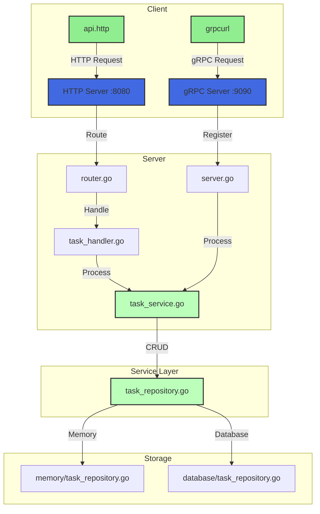

# Task Manager Example

This example is showing my skills on how to write a Golang web api that supports both http and grpc

```mermaid
graph TD
    subgraph Client
        A[api.http] -->|HTTP Request| B[HTTP Server :8080]
        C[grpcurl] -->|gRPC Request| D[gRPC Server :9090]
    end

    subgraph Server
        B -->|Route| E[router.go]
        E -->|Handle| F[task_handler.go]
        F -->|Process| G[task_service.go]
        
        D -->|Register| H[server.go]
        H -->|Process| G
    end

    subgraph Service Layer
        G -->|CRUD| I[task_repository.go]
    end

    subgraph Storage
        I -->|Memory| J[memory/task_repository.go]
        I -->|Database| K[database/task_repository.go]
    end

    style A fill:#90EE90,stroke:#333,stroke-width:2px
    style C fill:#90EE90,stroke:#333,stroke-width:2px
    style B fill:#4169E1,stroke:#333,stroke-width:2px
    style D fill:#4169E1,stroke:#333,stroke-width:2px
    style G fill:#bfb,stroke:#333,stroke-width:2px
    style I fill:#bfb,stroke:#333,stroke-width:2px
```
